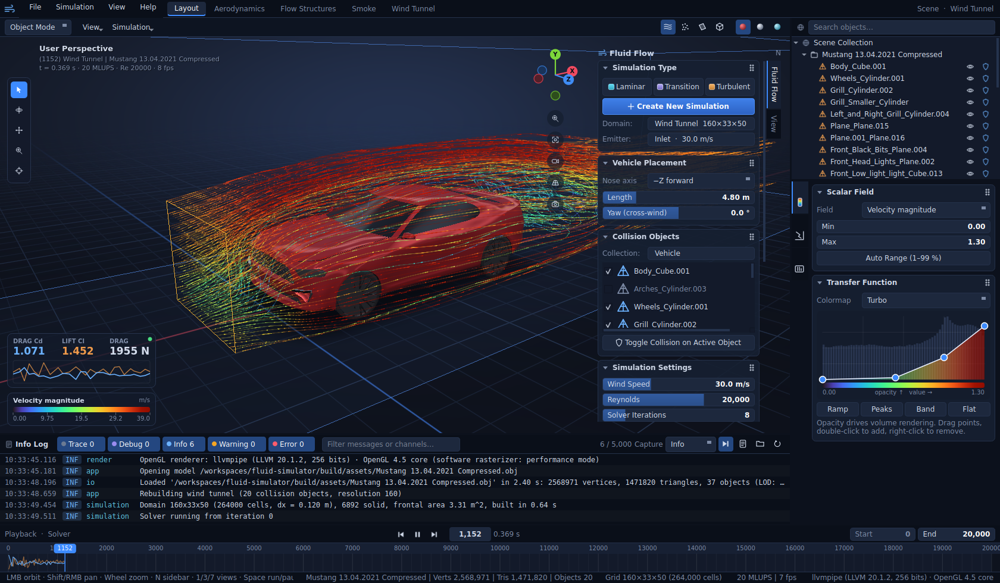
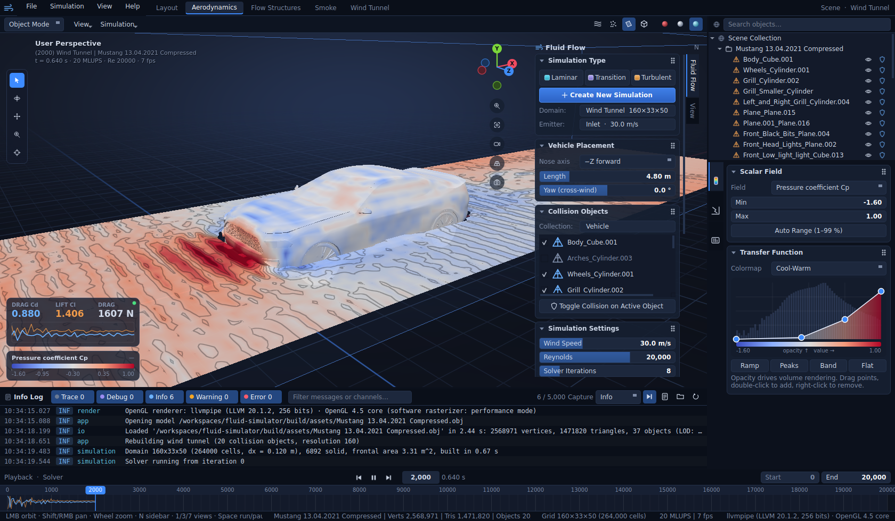
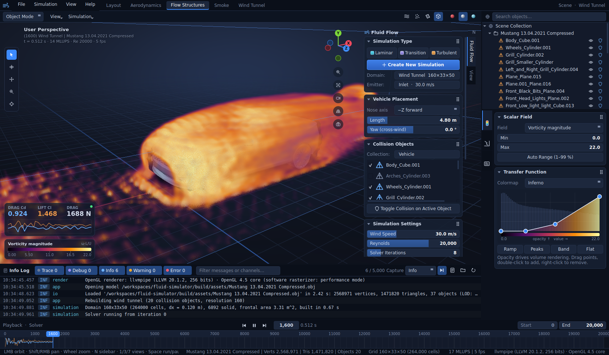
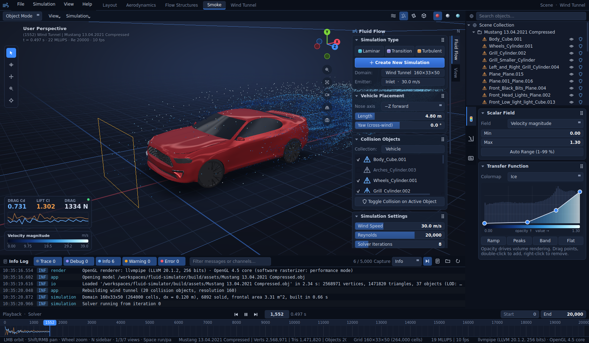
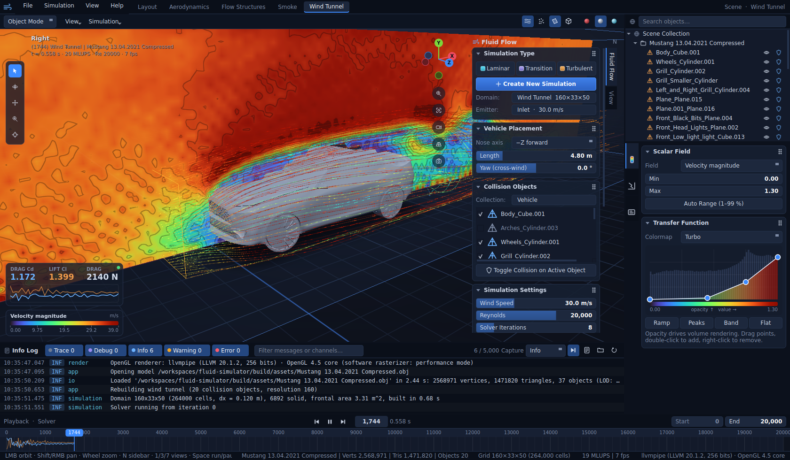

# Wind Tunnel: real-time virtual aerodynamics in C++23 / Qt 6

A desktop fluid simulator

A multithreaded **D3Q19 lattice-Boltzmann LES solver** computes the flow,
and a Blender-style UI (dark, blue) built on **`QGraphicsView` + OpenGL 3.3** shows it.

<!--  -->


### Visualizations

Each workspace in the top bar opens a preset visualization of the same running simulation.

| | |
|---|---|
|  |  |
| **Aerodynamics**: pressure coefficient Cp on the car surface and on a ground slice with iso-contours (Cool-Warm) | **Flow Structures**: volume-rendered vorticity magnitude showing the wake (Inferno) |
|  |  |
| **Smoke**: particles released from the emitter rake and advected by the flow (Ice) | **Wind Tunnel**: side view with a velocity-magnitude slice and streamlines (Turbo) |

The **Layout** workspace (above) shows velocity-coloured streamlines from the emitter rake over the studio-shaded car.

## Build & run

```bash
cmake -S . -B build -DCMAKE_BUILD_TYPE=Release   # also extracts the sample OBJ into build/assets
cmake --build build -j
./build/tests/run-test                            # Catch2 unit tests (core library)
./build/tests/run-app-test                        # application tests (logging)
./build/app/windtunnel                            # launches the application
```

Command-line options (`windtunnel --help` lists them all):

| Option | Default | Description |
|---|---|---|
| `--model <file.obj>` | sample Mustang in `build/assets` | Wavefront OBJ model to load. If the file is missing the app starts empty; use *File → Open Model*. |
| `--resolution <cells>` | 160 | Grid cells along the tunnel length (64–352). Higher values resolve more detail but run slower. |
| `--workspace <0..4>` | 0 | Workspace to open: 0 Layout, 1 Aerodynamics, 2 Flow Structures, 3 Smoke, 4 Wind Tunnel. |
| `--paused` | off | Load the scene without starting the solver. |
| `--screenshot <out.png>` | — | Save a screenshot of the window after `--delay` seconds, then quit. |
| `--report <out.pdf>` | — | Export the PDF report after `--delay` seconds, then quit. |
| `--delay <seconds>` | 8 | Time the solver runs before `--screenshot` / `--report`. |
| `--log-level <level>` | `info` | `trace`, `debug`, `info`, `warn`, `error`, `critical` or `off`. |
| `--verbose` | off | Shortcut for `--log-level debug`. |
| `--log-file <path\|none>` | app data folder, `logs/windtunnel.log` | Rotating log file; `none` disables it. |

For example, `./build/app/windtunnel --workspace 2 --resolution 224 --screenshot wake.png --delay 30`
captures the vorticity volume at a finer resolution without any interaction.

Requires Qt ≥ 6.2 (Widgets, OpenGL, OpenGLWidgets, Concurrent). spdlog, argparse and Catch2 are fetched by CMake.

## Using it

| Area | What it does |
|---|---|
| **Viewport** (`QGraphicsView`) | LMB orbit · Shift/RMB pan · wheel zoom · double-click frames · `1/3/7` views (Ctrl = opposite) · `5` ortho · `N` sidebar · `Space` run/pause |
| **Tool shelf** (left) | select/orbit, pan, zoom, **probe** (click the car or the slice to read speed, Cp and vorticity) |
| **Gizmo** (top right) | click an axis to snap the view, drag to orbit; buttons for zoom, frame, ¾ view, ortho, screenshot |
| **Fluid Flow sidebar** | simulation type presets, *Create New Simulation*, vehicle placement (nose axis, length, **yaw / cross-wind**), collision objects, solver settings (wind speed, Reynolds, iterations, resolution, Smagorinsky, turbulence, rolling road, tunnel size), emitter rake. *View* tab: shading, streamlines, particles, slice, volume, quality |
| **Workspaces** (top bar) | Layout · Aerodynamics (surface Cp + slice) · Flow Structures (volume-rendered vorticity) · Smoke · Wind Tunnel (side slice) |
| **Outliner** | collections with visibility and collision toggles and a search filter |
| **Properties** | scalar field, range, colormap and an interactive **transfer-function editor** (a `QGraphicsView` with draggable control points over a live histogram), Cd/Cl/Cs, forces, drag power, convergence, PDF report with preview |
| **Timeline** | run / step / reset, iteration counter, end iteration (auto-pause) and a Cd/Cl trace under the playhead |
| **Info Log** (below the viewport, Ctrl+L) | session log with coloured levels; toggle trace / debug / info / warning / error (with counts), search messages and channels, change the capture level, auto-scroll, copy, clear, open the log file |

All numeric fields are Blender-style: drag to scrub (Shift = fine, Ctrl = snap), click to type, Ctrl+wheel to step.

**Rendering quality** is adaptive. On a GPU the viewport uses the full 1.47M-triangle mesh with 4× MSAA.
On a software rasterizer (for example `llvmpipe` in a container without GPU passthrough) it switches to
the 70k-triangle LOD with FXAA, about 4× faster. You can override this under *View → Overlays → Quality*.
Set `WT_PROFILE=1` to log the 3D render time per frame.

**Physics notes.** The simulated Reynolds number is set explicitly: real air around a car reaches
Re ≈ 10⁷, which no real-time grid can resolve, and the Smagorinsky model stands in for the unresolved
scales. At the default 160-cell resolution the car is about 40 cells long. Coefficients such as Cd ≈ 0.7–0.8
are therefore indicative only; they converge towards the real value as the resolution goes up.
